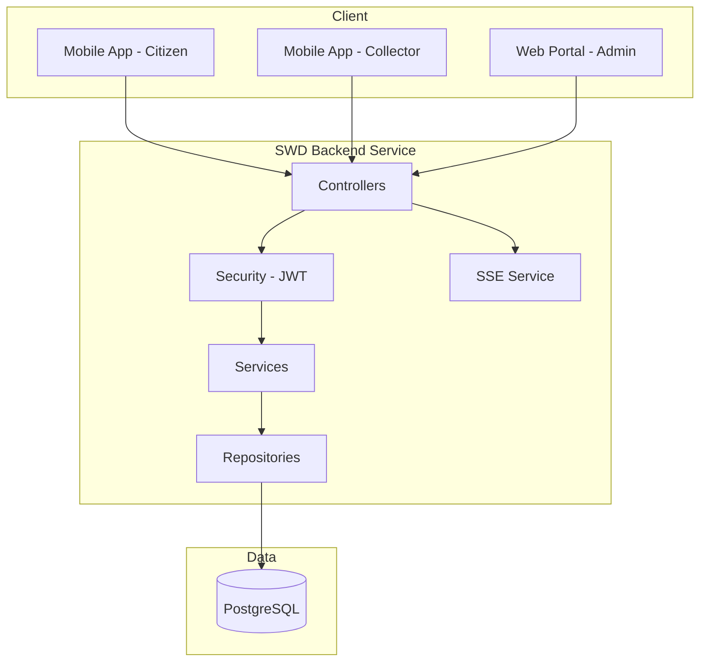

# System Architecture

> **Hướng dẫn sử dụng**: Kiến trúc hệ thống SWD Backend Service (từ README.md).

---

## 1. Tech Stack

### Core Technologies

| Layer | Technology | Version |
|-------|------------|---------|
| **Language** | `Java` | `21` |
| **Framework** | `Spring Boot` | `3.5.0` |
| **Database** | `PostgreSQL` | `15+` |
| **Build Tool** | `Maven` | `3.8+` |
| **Geo-Spatial** | `PostGIS` | `3.x` (Recommended) |

---

## 2. Architecture Pattern

```
[x] Layered (Controller-Service-Repository)
```

### Selected Pattern: `Layered Architecture`

**Rationale**: 
```
Feature-based package structure cho mỗi module.
Mỗi feature có: controller/, dto/, entity/, repository/, service/
```

---

## 3. System Diagram



---

## 4. Folder Structure (Refined)

```
backend/
├── src/main/java/com/example/backendservice/
│   ├── BackendServiceApplication.java          # Main entry point
│   │
│   ├── common/                                  # Common/Shared components
│   │   ├── config/
│   │   ├── constants/
│   │   ├── dto/
│   │   ├── exception/
│   │   └── sse/                                
│   │
│   ├── features/                               # Feature modules
│   │   ├── auth/                               # ✅ Authentication (User/Role)
│   │   │   ├── controller/
│   │   │   ├── dto/
│   │   │   └── service/
│   │   │
│   │   ├── location/                           # ✅ Service Area & Location
│   │   │   ├── entity/ServiceArea.java
│   │   │   └── controller/ServiceAreaController.java
│   │   │
│   │   ├── enterprise/                         # ✅ Enterprise Management
│   │   │   ├── entity/EnterpriseCapability.java
│   │   │   ├── entity/EnterpriseWasteType.java
│   │   │   └── controller/EnterpriseController.java
│   │   │
│   │   ├── waste/                              # ✅ Waste Reporting
│   │   │   ├── entity/WasteReport.java
│   │   │   ├── entity/WasteType.java
│   │   │   └── controller/WasteReportController.java
│   │   │
│   │   ├── task/                               # ✅ Task Assignment
│   │   │   ├── entity/Task.java
│   │   │   ├── entity/TaskAssignment.java
│   │   │   └── controller/TaskController.java
│   │   │
│   │   ├── collection/                         # ✅ Collection Execution
│   │   │   ├── entity/CollectionVisit.java
│   │   │   └── controller/CollectionController.java
│   │   │
│   │   ├── reward/                             # ✅ Rewards & Rules
│   │   │   ├── entity/RewardTransaction.java
│   │   │   ├── entity/CitizenRewardRule.java
│   │   │   ├── entity/WasteScoreSystem.java
│   │   │   └── service/RewardService.java
│   │   │
│   │   ├── analytics/                          # ✅ Stats & Reports (Enterprise/Admin)
│   │   │   ├── dto/WasteStatsDto.java
│   │   │   └── controller/AnalyticsController.java
│   │   │
│   │   └── kpi/                                # ✅ Performance & KPI
│   │       ├── entity/CollectorKpiDaily.java
│   │       └── service/KpiService.java
│   │
│   └── security/                               # Security configuration
│
└── README.md
```

---

## 5. Key Design Decisions

### Decision 1: `Feature-based Package Structure`
- **Context**: Cần tổ chức code dễ navigate với nhiều domain mới (Waste, Task, KPI).
- **Decision**: Mỗi feature (User, Waste, Task, Reward) có folder riêng.
- **Consequences**: Dễ mở rộng, giảm sự phụ thuộc chéo.

### Decision 2: `Geo-Spatial Data Handling`
- **Context**: Báo cáo rác và Service Area cần tọa độ/biên giới.
- **Decision**: Sử dụng `DOUBLE lat/lng` cho điểm đơn giản, `PostGIS` (WKT) cho biên giới Area.
- **Consequences**: Cần xử lý data transformation DTO <-> Entity.

---

## 6. API Endpoints Overview

### Waste Reporting (Citizen)
| Method | Endpoint | Description |
|--------|----------|-------------|
| POST | `/api/waste-reports` | Tạo báo cáo rác mới |
| GET | `/api/waste-reports/history` | Xem lịch sử báo cáo |

### Task Management (Admin/system)
| Method | Endpoint | Description |
|--------|----------|-------------|
| POST | `/api/tasks/assign` | Gán task cho collector |
| GET | `/api/tasks/collector/{id}` | Lấy danh sách task của collector |

### Collection (Collector)
| Method | Endpoint | Description |
|--------|----------|-------------|
| POST | `/api/collection-visits` | Check-in điểm thu gom (kèm ảnh) |
| PUT | `/api/tasks/{id}/status` | Cập nhật trạng thái Task |
