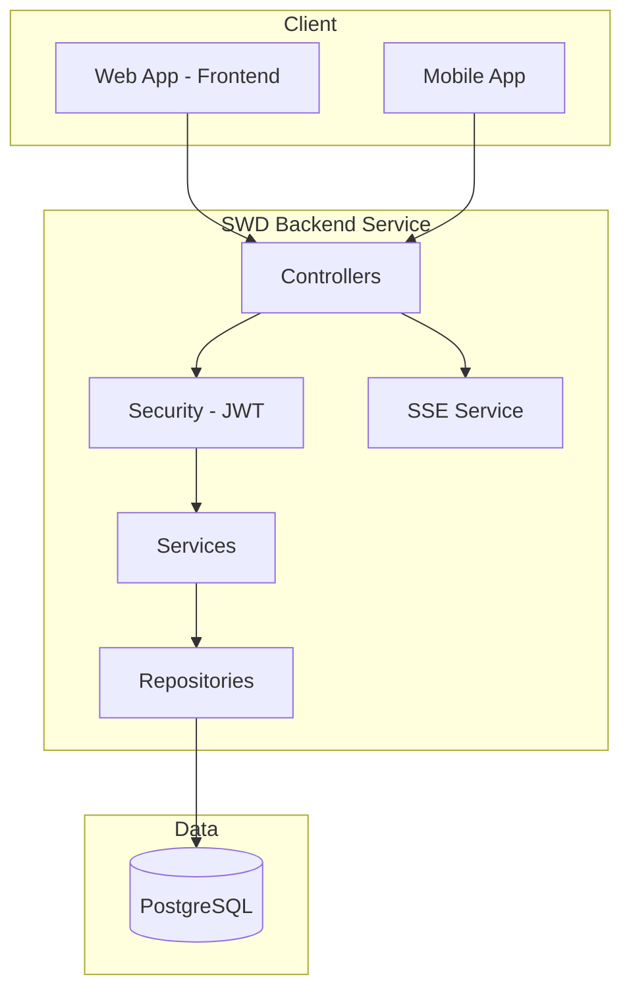

# System Architecture

> **Hướng dẫn sử dụng**: Kiến trúc hệ thống SWD Backend Service (từ README.md).

---

## 1. Tech Stack

### Core Technologies

| Layer | Technology | Version |
|-------|------------|---------|
| **Language** | `Java` | `17` |
| **Framework** | `Spring Boot` | `3.5.0` |
| **Database** | `PostgreSQL` | `15+` |
| **Build Tool** | `Maven` | `3.8+` |

### Dependencies

| Dependency | Version | Purpose |
|------------|---------|---------|
| Spring Boot | 3.5.0 | Framework |
| Spring Security | - | Authentication & Authorization |
| Spring Data JPA | - | Database ORM |
| PostgreSQL Driver | - | Database driver |
| JWT (jjwt) | 0.11.5 | JWT token handling |
| Lombok | - | Boilerplate reduction |
| SpringDoc OpenAPI | 2.3.0 | Swagger/API documentation |

### Development Tools

| Tool | Purpose |
|------|---------|
| `Docker` | Containerization |
| `Maven Wrapper (mvnw)` | Build tool |
| `Swagger UI` | API testing |

---

## 2. Architecture Pattern

```
[x] Layered (Controller-Service-Repository)
```

### Selected Pattern: `Layered Architecture`

**Rationale**: 
```
Feature-based package structure cho mỗi module.
Mỗi feature có: controller/, dto/, entity/, repository/, service/
```

---

## 3. System Diagram



---

## 4. Folder Structure (From README.md)

```
backend/
├── src/main/java/com/example/backendservice/
│   ├── BackendServiceApplication.java          # Main entry point
│   │
│   ├── common/                                  # Common/Shared components
│   │   ├── config/
│   │   │   ├── DataSeeder.java                 # Sample data (dev profile)
│   │   │   └── OpenApiConfig.java              # Swagger/OpenAPI config
│   │   ├── constants/
│   │   │   └── NotificationConstants.java
│   │   ├── dto/
│   │   │   ├── ApiResponse.java                # Standard API response
│   │   │   └── PageResponse.java               # Pagination response
│   │   ├── exception/
│   │   │   └── GlobalExceptionHandler.java
│   │   └── sse/                                # Server-Sent Events
│   │       ├── SseController.java
│   │       ├── SseEventData.java
│   │       └── SseService.java
│   │
│   ├── config/
│   │   └── CorsConfig.java                     # CORS configuration
│   │
│   ├── features/                               # Feature modules
│   │   ├── auth/                               # ✅ Authentication
│   │   │   ├── controller/AuthController.java
│   │   │   ├── dto/
│   │   │   │   ├── AuthRequest.java
│   │   │   │   ├── AuthResponse.java
│   │   │   │   └── RegisterRequest.java
│   │   │   └── service/AuthService.java
│   │   │
│   │   ├── user/                               # ✅ User Management
│   │   │   ├── controller/UserController.java
│   │   │   ├── dto/
│   │   │   ├── entity/
│   │   │   │   ├── User.java
│   │   │   │   └── Citizen.java
│   │   │   ├── repository/
│   │   │   │   ├── UserRepository.java
│   │   │   │   └── CitizenRepository.java
│   │   │   └── service/
│   │   │
│   │   ├── complaint/                          # ✅ Complaint Management
│   │   │   ├── controller/ComplaintController.java
│   │   │   ├── dto/
│   │   │   │   ├── ComplaintResponse.java
│   │   │   │   ├── CreateComplaintRequest.java
│   │   │   │   └── UpdateComplaintStatusRequest.java
│   │   │   ├── entity/Complaint.java
│   │   │   ├── repository/ComplaintRepository.java
│   │   │   └── service/
│   │   │       ├── ComplaintService.java
│   │   │       └── ComplaintServiceImpl.java
│   │   │
│   │   ├── notification/                       # ✅ Notification Management
│   │   │   ├── controller/NotificationController.java
│   │   │   ├── dto/
│   │   │   │   ├── CreateNotificationRequest.java
│   │   │   │   ├── NotificationResponse.java
│   │   │   │   └── UpdateNotificationRequest.java
│   │   │   ├── entity/Notification.java
│   │   │   ├── repository/NotificationRepository.java
│   │   │   └── service/
│   │   │       ├── NotificationService.java
│   │   │       └── NotificationServiceImpl.java
│   │   │
│   │   └── reward/                             # 🎁 NEW: Reward Management
│   │       ├── controller/
│   │       │   └── AdminRewardController.java
│   │       ├── service/
│   │       │   ├── RewardService.java
│   │       │   └── RewardServiceImpl.java
│   │       ├── repository/
│   │       │   ├── RewardItemRepository.java
│   │       │   └── RewardRedemptionRepository.java
│   │       ├── entity/
│   │       │   ├── RewardItem.java
│   │       │   └── RewardRedemption.java
│   │       └── dto/
│   │           ├── RewardItemCreateRequest.java
│   │           ├── RewardItemResponse.java
│   │           └── RedemptionResponse.java
│   │
│   └── security/                               # Security configuration
│       ├── config/SecurityConfig.java
│       ├── jwt/
│       │   ├── JwtAuthenticationFilter.java
│       │   └── JwtService.java
│       └── service/CustomUserDetailsService.java
│
├── src/main/resources/
│   ├── application.properties                  # Base config (profile selector)
│   ├── application-dev.properties              # Development (PostgreSQL local)
│   └── application-deploy.properties           # Production (PostgreSQL cloud)
│
├── src/test/java/com/example/backendservice/
│   └── features/
│       ├── complaint/ComplaintServiceTest.java
│       └── notification/NotificationServiceTest.java
│
├── pom.xml
├── mvnw / mvnw.cmd                             # Maven wrapper
└── README.md
```

---

## 5. Key Design Decisions

### Decision 1: `Feature-based Package Structure`
- **Context**: Cần tổ chức code dễ navigate
- **Decision**: Mỗi feature có folder riêng với controller/dto/entity/repository/service
- **Consequences**: Dễ tìm file liên quan, mỗi feature độc lập

### Decision 2: `JWT Stateless Authentication`
- **Context**: Cần authentication cho API
- **Decision**: Sử dụng JWT với jjwt library
- **Consequences**: Stateless, scalable, token expiration 24h

### Decision 3: `Server-Sent Events (SSE) for Realtime`
- **Context**: Cần push notifications realtime
- **Decision**: Sử dụng SSE thay vì WebSocket
- **Consequences**: Simpler, HTTP-based, one-way communication

---

## 6. Environment Configuration

| Environment | URL | Purpose |
|-------------|-----|---------|
| **Local** | `localhost:8080` | Development |
| **Swagger** | `localhost:8080/swagger-ui.html` | API Testing |

### Profiles
| Profile | Database | CORS |
|---------|----------|------|
| `dev` | PostgreSQL local (`swd_dev`) | `localhost:3000,5173` |
| `deploy` | PostgreSQL cloud (env vars) | Configurable |

---

## 7. Authentication & Authorization

### Auth Method
```
[x] Stateless JWT
[x] Role-based Access Control (RBAC)
[x] BCrypt Password Encryption
```

### Implementation Details
```
- JWT token với jjwt 0.11.5
- Token expiration: 24h (86400000ms)
- Roles: ADMIN, CITIZEN, COLLECTOR, ENTERPRISE
- JWT secret configurable via properties/env
```

---

## 8. Existing API Endpoints (From README.md)

### Authentication
| Method | Endpoint | Description |
|--------|----------|-------------|
| POST | `/api/auth/register` | Register new user |
| POST | `/api/auth/login` | Login and get JWT |

### Complaint Management
| Method | Endpoint | Role |
|--------|----------|------|
| POST | `/api/complaints/citizen/{citizenId}` | CITIZEN |
| GET | `/api/complaints/citizen/{citizenId}` | CITIZEN |
| GET | `/api/complaints/{complaintId}` | ALL |
| GET | `/api/complaints/admin` | ADMIN |
| PUT | `/api/complaints/admin/{id}/status` | ADMIN |
| DELETE | `/api/complaints/admin/{id}` | ADMIN |
| GET | `/api/complaints/admin/statistics` | ADMIN |

### Notification Management
| Method | Endpoint | Role |
|--------|----------|------|
| POST | `/api/notifications/admin/{adminId}` | ADMIN |
| GET | `/api/notifications/admin` | ADMIN |
| GET | `/api/notifications/admin/{id}` | ADMIN |
| PUT | `/api/notifications/admin/{id}` | ADMIN |
| PATCH | `/api/notifications/admin/{id}/toggle` | ADMIN |
| DELETE | `/api/notifications/admin/{id}` | ADMIN |
| GET | `/api/notifications/user/{role}` | USER |
| GET | `/api/notifications/count` | PUBLIC |

### SSE
| Method | Endpoint | Role |
|--------|----------|------|
| GET | `/api/sse/subscribe/{userId}` | AUTHENTICATED |
| GET | `/api/sse/stats` | ADMIN |
| POST | `/api/sse/test-broadcast` | ADMIN |
